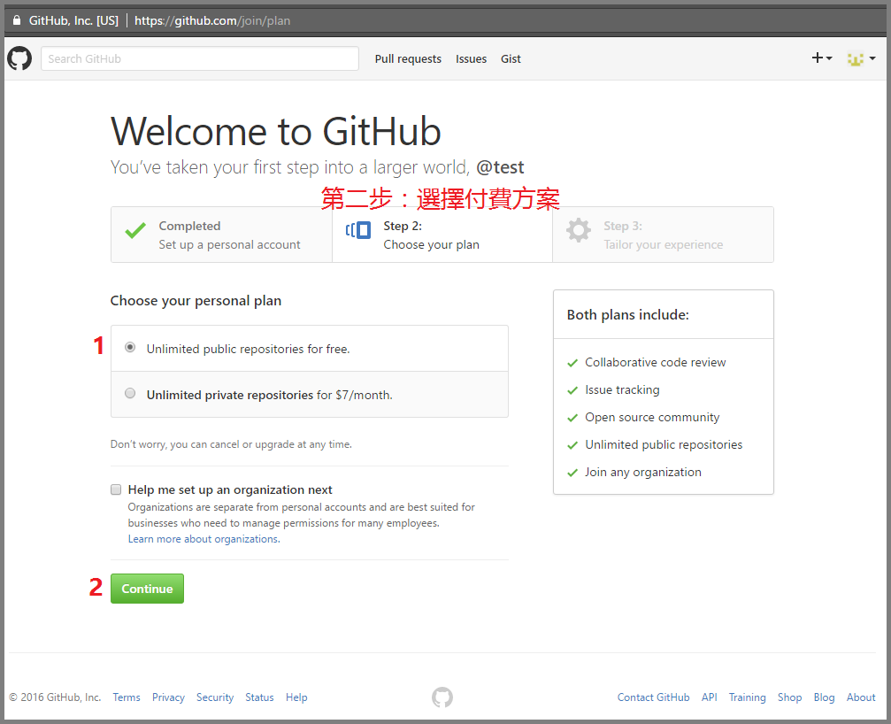
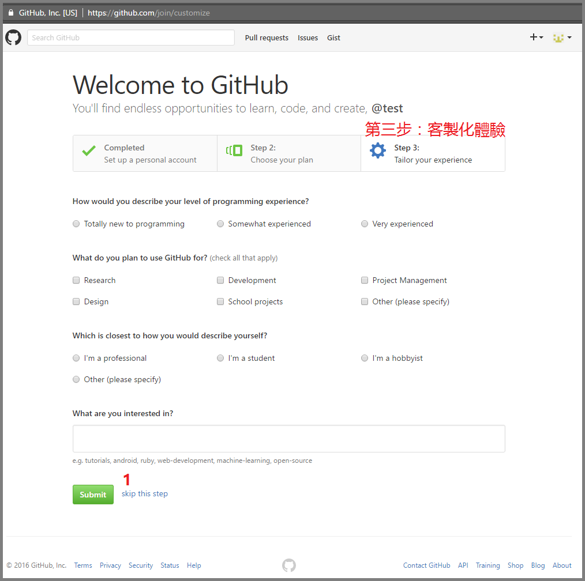
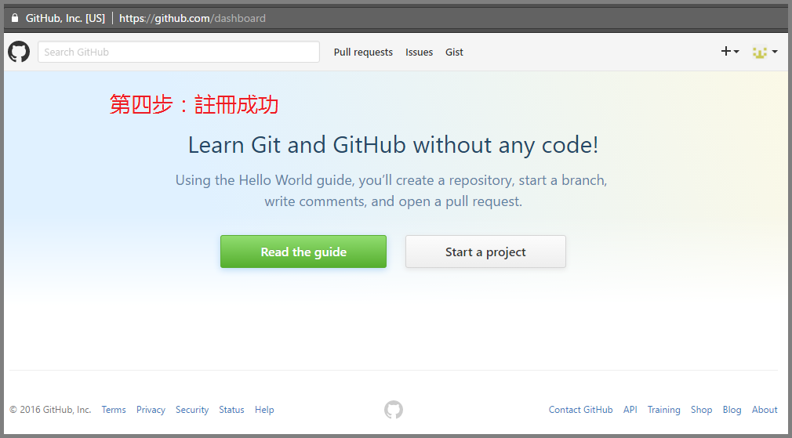
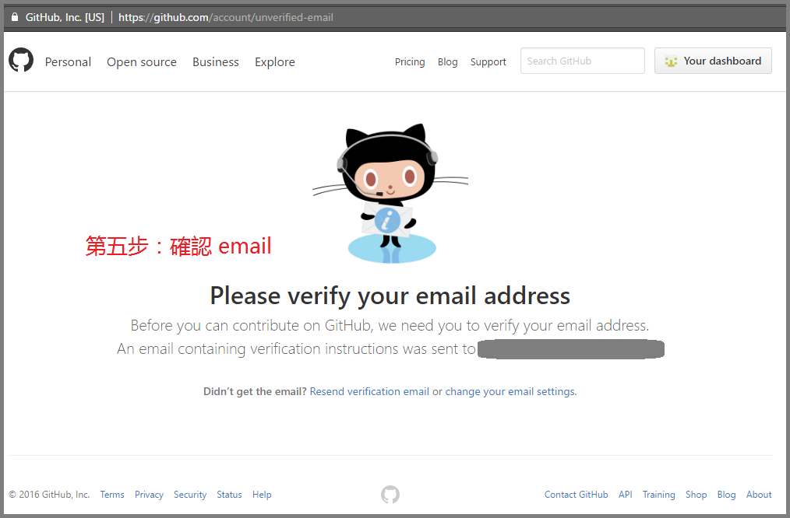

# 第一步：設立個人帳號

1.  前往 [https://github.com/join][1]
2.  選擇你的使用者名稱（建議：只使用英語字母或數字符號）
3.  填入你的 email
4.  選擇你的使用者密碼
5.  點選 `Create an account`

[1]: https://github.com/join

# 第二步：選擇付費方案（可選免費方案）

1.  預設選項即是免費方案
2.  點選 `Continue`

# 第三步：客製化體驗

1.  這只是問卷調查，可以直接點選 `skip this step` 略過

# 第四步：註冊成功

如果你還沒確認 email, 請繼續往下看第五步。

如果你已經確認過 email, 可以前往[新手教學][2] 或
[馬上開始參與社群活動][3] 。

[2]: onboarding.md
[3]: https://github.com/teach-and-learn

# 第五步：確認 email

如果你還沒確認 email, 在使用一些進階的 GitHub 功能時，就會被要求確認你的
email 地址。

此時請查看你在「第一步：設立個人帳號」所使用的 email  信箱，應該會收到一
封來自 GitHub 的信，信中有一連結，點擊之後會連回 GitHub 的網站，進行
email 地址的確認。

